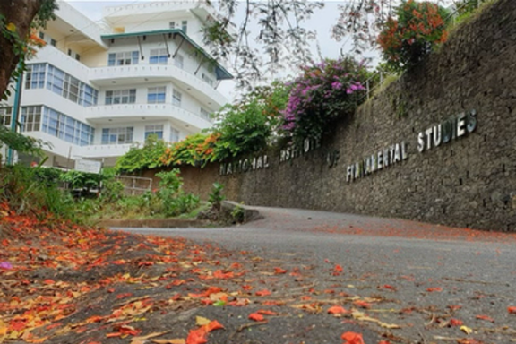

> [education](../)

> IFS, Hantana, Kandy

## Institute of Fundamental Studies (IFS)

The IFS was founded by Professor Cyril Ponnamperuma who was the Lead Scientist who analyzed the soil samples from the moon from the inaugural Apollo Lunar Mission in 1969.

* [Computer Division](computer)
* [Geology Division](geology)
* [French Revolution](french)
* [Gam Udawa](gam-udawa)
* [Light a Candle](candle)
