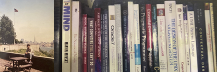

> [home](/)
> &bull; [contact](contact)

## Ruchira Bomiriya

> To know thyself is the beginning of wisdom.  
> **Socrates**

| [Education](education) | [Work](work) | [Interests](interests) |

I am a Strategy Consultant residing in Sri Lanka.
I graduated from Stevens Institute of Technology in Hoboken, New Jersey, USA
as a Computer Engineer with a minor in Philosophy in 1996.
I have more than a quarter of a century of experience in software development,
starting at Salomon Brothers in New Jersey and New York working with Trading Systems in C++.
My general interests revolve around Philosophy, Psychology, Strategy and Systems.

Currently, I spend time studying General Purpose Languages, Operating Systems and Systems Design
with emphasis on simplicity, elegance, semantics and evolution.
It is good to reflect on your past experience and have a critical look at current developments in the industry.
These are also the areas of focus in my consulting work: _programming is resource management_.

In the area of automated intelligence, I focus on Cognitive Intelligence
coupled with Integrated Coherent Knowledge Structures and Evolution.
These will come in handy after the Statistical Intelligence wave dies down and
makes it obvious that Human Cognitive Intelligence is far superior
to Statistical Inference techniques involving large data sets.
You can't invent the future staring at the rear view mirror.
Let's be thoughtful and patient.

Hopefully, this realization will be triggered by the demonstrated futility of
redirecting all the world's generated power, all intellectual efforts and money into
large data centers hoping it will make human intelligence any better let alone make you more powerful.
We are forgetting that we need to feed our children with both nutrition and intelligence
instead of seeking to somehow contain and exploit them using machines.

All the current AI hype may be due to a certain butterfly flapping its wings somewhere in the Amazon
or because Eric Schmidt just couldn't find agreeable programmers who would simply do what he says
without questioning his authority.
Take your pick! ;)

I am an [INTP](/mbti/types/intp).
