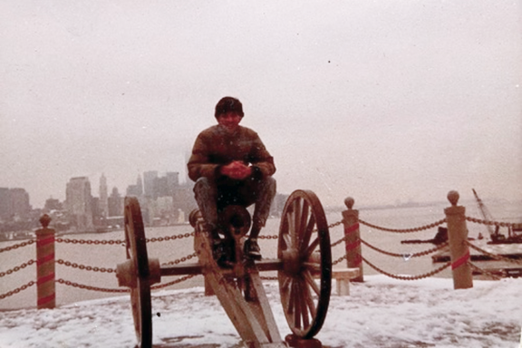

> [work](./)

>  Ei™ was housed in the main building of the [Stevens](/profile/education/stevens) campus at Castle Point.  Across the Hudson River is New York City.  Castle Point and the Hudson River are separated by Sinatra Drive.

## Engineering Information, Inc.

Ei was an established Library Reference provider which had a CD-ROM based product serving universities and corporates around the world.  They were working on a _Web_ based version of the product in 1995 when I joined them.

I worked with the Vice President of Marketing and created their brand new website. I also designed a content management prototype in Perl.  I worked there until I graduated in 1996.  The company was later acquired by Reed Elsevier, the global publishing giant.
