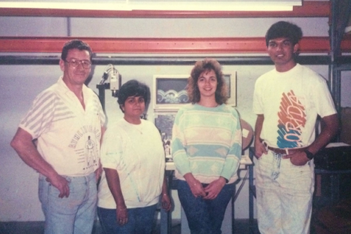

> [work](./)

> The first ALCM production setup at the plant in Jacksonville, Florida.

## Maidenform, Inc.

I started working at Maidenform as a co-op student in 1991.  Automated Lace Cutting Machine (ALCM) was the name of the project.  Lace had usually been layered about a dozen times and cut manually using a mechanical die.  Since the lace is not regular, this resulted in unacceptable offsets, often compounded by human error.  The goal of the ALCM was to increase the accuracy and also the overall speed of the lace cutting process.  The initial target was 25 cuts per minute.

The innovation required fast recognition of patterns in the lace as well as servo motor driven movement coupled with an electro-magnetic die, all co-ordinated and executed by software.  I worked with BASIC, 8088 Assembly and C.  Later, I worked with C++ exploring ways to speed up as well as generalize pattern recognition.  I worked there until the end of 1993 and we overshot both the accuracy and the speed targets and were cutting at 70 cuts per minute.
