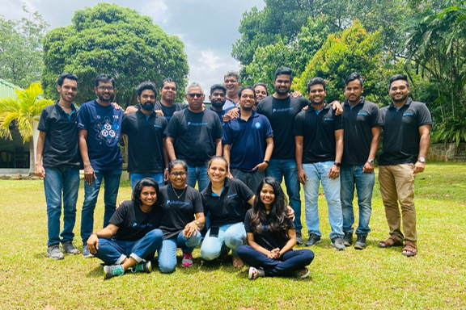

> [work](./)

> Team outing at Sanctuary Lodge.

## Platformer

Platformer was an Australian cloud computing startup specializing in Kubernetes.  The company, started by Kanchana Wickremasinghe in Melbourne also had a development team in Sri Lanka.  I joined in 2020 and worked as Senior Consultant, Strategy until the company was acquired by [WSO2](https://wso2.com) in 2021.
