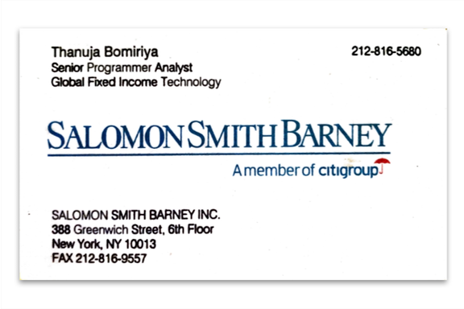

> [work](./)

## Salomon Smith Barney, Inc.

I joined Salomon Brothers in 1996, right after graduation from [Stevens](/profile/education/stevens).  Initially, I worked in the Global Database Engineering Group (GDES).  The standard database on Wall Street was Sybase.  I got trained as a Sybase Database Administrator and also on Sybase Performance and Tuning.  Later, I returned to my passion &mdash; programming &mdash; in the Finance Desk Trading System (FDTS) team.  I was programming in C++ and Perl among other things, directly supporting the trading desk.

Salomon Brothers merged with Smith Barney of the Travellers Group and became Salomon Smith Barney.  When Citibank merged with the Travellers Group forming Citigroup, the Citibank loans group merged with Salomon Smith Barney.  I was the first member of the Loans Desk Trading System (LDTS) team.  I returned to Sri Lanka in the year 2000.
